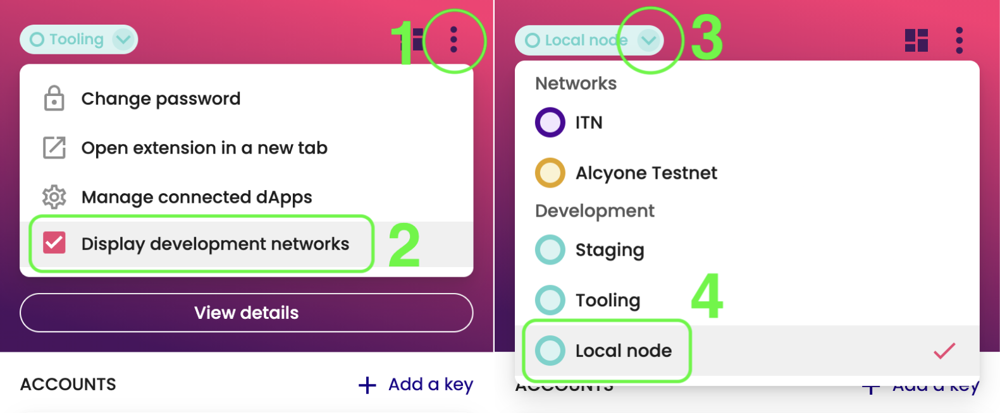

# Polymesh Wallet

A simple browser extension that facilitates managing your Polymesh accounts outside of dapps. Injects the accounts and allows signing transactions for a specific account.

With the Polymesh Wallet, you can: 
- Create and manage your keys, including organizing them by Polymesh ID. 
- View and monitor the POLYX balance on each key.
- Securely sign transactions, either with extension keys or with a hardware wallet.
- Select a chain to connect to such as Polymesh development networks, incentivized testnet, or the eventual mainnet.
- Connect to the Polymesh Dashboard and other Polymesh distributed apps (dApps) for enhanced benefits.

The extension wraps [Polkadot{.js} extension](https://github.com/polkadot-js/extension) and aims to offer optimized experience to Polymesh dapp users. It retrieves and displays account chain data such as: account balance, Polymesh ID, and onboarding status. Data is retrieved via Websocket [API](https://github.com/polkadot-js/api) connection, then stored in a central [Redux](https://redux.js.org/) and finally, redux store data gets persisted to local storage.

Additionally, the wallet enables importing user's confidential identity from KYC providers, and then encrypts it with AES and stores in local storage. User must provide a password to decrypt the confidential identity for purpose of viewing, or to generate a uniqueness proof. 

## Installation

- On Chrome, install via [Chrome web store](https://chrome.google.com/webstore/detail/polymesh-wallet/jojhfeoedkpkglbfimdfabpdfjaoolaf). _Firefox extension coming soon._

## Development environment

Steps to build the extension and view your changes in a browser:

1. Clone repository `git clone git@github.com:PolymeshAssociation/polymesh-wallet.git`
1. Build via `yarn build` or `yarn watch`
2. Install the extension
  - Chrome:
    - go to `chrome://extensions/`
    - ensure you have the Development flag set
    - "Load unpacked" and point to `packages/extension/build`
    - if developing, after making changes - refresh the extension

_Optionally_, you can connect to a local Polymesh node running on `ws://localhost:9944`, by selecting "Local node" from networks menu, after you enable dev network display.



## Development

The repo is split into a number of packages

- [extension](packages/extension/) - The main entry point that glues everything else together.
- [ui](packages/ui/) - The UI components for the extension, to build up the popup.
- [core](packages/core/) - Polymesh-specific request handlers, api connection and data fetching and storage.

You can find more information about the [directory structure here](docs/directory-structure.md)

## Dapp developers

The extension is compatible with the convenience @polkadot/extension-dapp wrappers. They allows for any dapps to access the injected extension object for purpose of signing, amongst other things.

Besides the [API interface](https://github.com/polkadot-js/extension) of Polkadot.js extension that we inherit and the re-provide, Polymesh extension provides the few additional APIs highlighted below.

## API interface

```js
enum NetworkName {
  pmf = 'pmf',
  alcyone = 'alcyone',
  pme = 'pme',
  local = 'local'
  itn = 'itn'
}

type NetworkMeta = {
  name: NetworkName,
  label?: string,
  wssUrl: string
}

// An interface that exposes the currently selected network
interface InjectedNetwork {
  get: () => Promise<NetworkMeta>;
  subscribe: (cb: (network: NetworkMeta) => void) => Unsubcall;
}

interface PolymeshInjected extends Injected {
  readonly network: InjectedNetwork;
}
```

### Examples

From a dapp, you can access the injected object in order to tap into additional APIs.

```js
web3Enable('A dapp').then((exts) => {
  // From the possibly multiple injected objects (eg if Polkadot.js extension is installed as well),
  // select Polymesh injected objects.
  const wallet = exts.filter(ext => ext.name === 'polywallet')[0]
  if (!wallet) {
    setError(new Error(`Please install Polymesh wallet extension from Chrome store`));
    return;
  }
```

Get or subscribe to the selected network

```js
wallet.network.get().then((network: NetworkMeta) => {
  // do something
});

wallet.network.subscribe((network) => {
  window.location.reload();
});
```

## Security audit

The extension has been reviewed and pen-tested in Q2 2021. The results can be found [here](docs/audit-may2021.pdf).